# Generation of satellite alike images with a conditional GAN

Final Project for the UPC [Artificial Intelligence with Deep Learning Postgraduate Course](https://www.talent.upc.edu/ing/estudis/formacio/curs/310402/postgraduate-course-artificial-intelligence-deep-learning/) 2020-2021 edition, authored by:

* [Luisa Fleta](https://www.linkedin.com/in/luisa-fleta-5a010422/)
* [Darío Cortizo](https://www.linkedin.com/in/dariocortizo/)
* [Diego Tascón](https://www.linkedin.com/in/diego-tascon-9139297/)

Advised by professor [Eva Mohedano](https://www.linkedin.com/in/eva-mohedano-261b6889/)

## Table of Contents 

1. [Introduction](#intro)
    1. [Motivation](#motivation)
    2. [Milestones](#milestones)
2. [The data set](#datasets)
3. [Working Environment](#working_env)
4. [General Architecture](#architecture)
5. [Preliminary Tests](#preliminary)
    1. [First steps](#initial)
    2. [Accessing the dataset](#datasetaccess)
    3. [Finding the right parameters](#parameters)
6. [The quest for improving the results](#improvingresults)
    1. [Modifying the dataset to get more details](#moredetails)
    2. [Instance Normalization](#instancenorm)
    3. [VGG Loss](#vggloss)
    4. [Using the ReduceLROnPlateau scheduler](#plateau)
    5. [Feeding bigger images](#biggerimages)
7. [The Google Cloud instance](#gcinstance)
8. [Result analysis](#results)
9. [Conclusions and Lessons Learned](#conclusions)
10. [Next steps](#next_steps)
11. [References](#references)
12. [Additional samples](#samples)

# Introduction 
Generative Adversarial Networks (GANs) were introduced by [Ian Goodfellow et al.](https://papers.nips.cc/paper/5423-generative-adversarial-nets) in 2014. GANs can make up realistic new samples from the distribution of images learned.

Conditional GANs (cGANs) where introduced by [Mehdi Mirza and Simon Osindero](https://arxiv.org/abs/1411.1784) also in 2014. cGANs allow directing the results generated using class labels, a part of data for impainting or data from other modalities. One of the most famous implementations of cGANs is [pix2pix](https://phillipi.github.io/pix2pix/).

In this project we're exploring the possibilities of applying conditional GANs to generate realistic satellite alike images.

## Motivation 

Conditional GANs offer multiple applications for generating tailored images in a target domain. Using them with satellite images sounded attractive and has a practical use case. Annotating images, specially aerial ones, is a hard and very time consuming task. So a cGAN trained to generate images from forged masks can help increasing the size of aerial datasets.

<a href="#toc">To top</a>

## Milestones 

The main milestones throughout this project were:
- Build a base model from an off-the-shelf implementation
- Train it with the chosen dataset, finding a good set of parameters
- Discuss possible model improvements
- Tune/Improve the base model
- Extract conclusions about the different improvements attempted

<a href="#toc">To top</a>

# The data set 

The [Inria Aerial Image Labeling Dataset](https://project.inria.fr/aerialimagelabeling/) provides in its training set 180 satellite images and their corresponding masks. All the images and masks have a resolution of 5000x5000 and are stored in TIFF format. Satellite images have 3 channels whilst their corresponding masks have only one channel. The masks label the buildings in the area:

There are also available 180 test images. Since they lack their corresponding mask, they would only be useful if extracting masks from satellite images, which would be the opposite direction of our work.

The training images were taken from 5 cities with different landscapes: Austin, Chicago, Kitsap, Tyrol and Vienna.

The whole training set is 15GB of space. Satellite images are 72MB each one and masks are around 1MB of size. As the model performed some transformations to each file, we generated a pretransformed dataset to accelerate the training process. Details on the procedure can be found in section [Accessing the dataset](#datasetaccess).

<a href="#toc">To top</a>

# Working environment 
We have developed the project using [Google Colab](https://colab.research.google.com/), which gave us easy and free access to GPUs. We've used both local Colab and Google Drive storage. For some parts, though, we've also used a local python container based on the offical [Docker Hub image](https://hub.docker.com/_/python). We've also created a [Google Cloud](https://cloud.google.com/) Deep Learning VM instance for longer trainings.

   

<a href="#toc">To top</a>

# General Architecture 
We've implemented a pix2pix model using [PyTorch](https://pytorch.org/). Although the creators of pix2pix have a published [PyTorch implementation](https://github.com/junyanz/pytorch-CycleGAN-and-pix2pix), as it combines both a CycleGAN and a pix2pix implementation, we started on a simpler one by [mrzhu](https://github.com/mrzhu-cool/pix2pix-pytorch).

The architecture of pix2pix is similar to that described for the original conditional GAN:

  

The generator is implemented with a U-Net of ResNet blocks:

 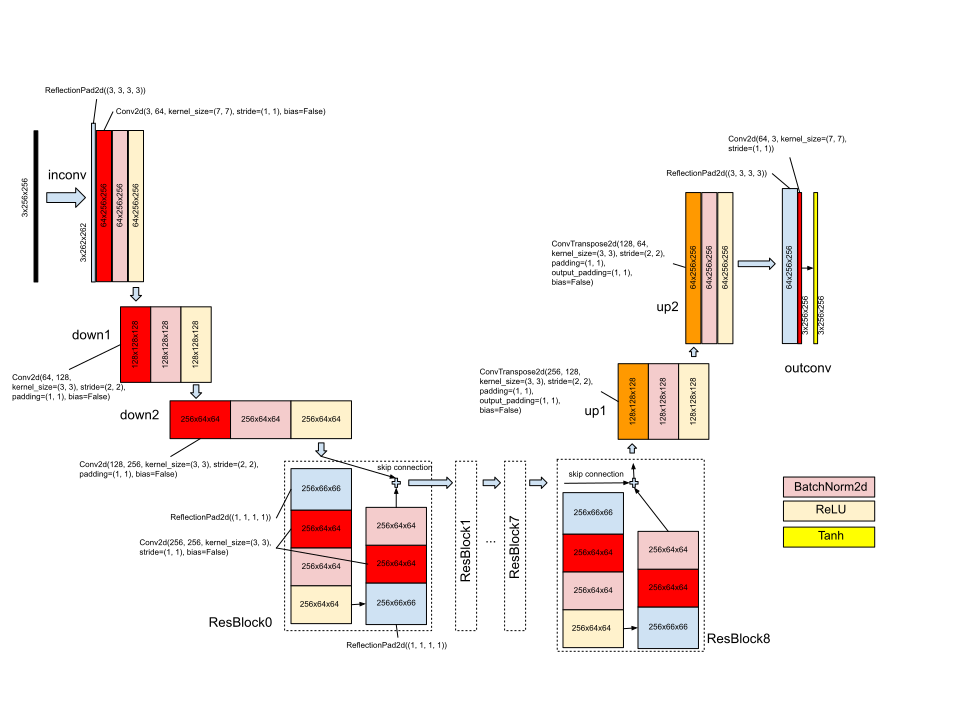 

The discriminator is implemented with a PatchGAN, a fully convolutional network designed to classify patches of an input image as real or fake, allowing to capture more details from the image. As the discriminator acts as a loss, two images are fed into this network:

 

_Note: hence in the chosen implementation, the author calculates an average PSNR metric against a so called "test" dataset. It can be thought as a validation dataset, although in the code you'll find references to a test phase, a testing data loader and so on. In the original pix2pix implementation there's no validation stage. A test script was provided to see the quality of results after a training was done_

<a href="#toc">To top</a>

# Preliminary Tests 
## First steps 
Our first steps with the chosen implementation were to understand it, compare it with the original pix2pix implementation and prepare a [Colab notebook](colab_notebooks/01_TrainOriginalImages.ipynb) to test de code. We incorporated access to our Google Drive account, logging to Tensorboard and basic debugging outputs.

## Accessing the dataset 
Understanding how to access the dataset was crucial. We followed the recommendations from [this article](https://towardsdatascience.com/preparing-tiff-images-for-image-translation-with-pix2pix-f56fa1e937cb) to discover that the TIFF masks had only one channel and their values were held in a [0:255] range, as PNG or JPEG images. Moreover, the picked implementation transformed the images, both satellite ones and masks, to RGB (adding 2 channels to the masks), so we didn't have to treat the dataset in a special way.

After feeling confortable with short trainings (10 or 20 epochs, 20 images) we started to make longer ones (300 epochs, 115 images), and that revealed a weakness of our model: every epoch could take up to 6 minutes. That resulted in 30 hours of training. Soon, Colab started complaining about our abuse of GPU usage. So we had to make something about it.

The dataset class (DatasetFromFolder)[dataset.py] read the 72MB satellite image and the 1MB corresponding mask in every epoch, converted to RGB, resized them to 286x286 images, transformed them to a torch tensor, normalized their values, made a 256x256 random crop and a random flip. Most of that work could be done previously and only once. So we made a [script](transform-dataset.py) to pretransform all the masks and images to 286x286 with normalized values and save them to .npy numpy array files. We also adapted the DatasetFromFolder class to read the new files, transform them into torch tensors to random crop and random flip them. A training epoch then lasted only 13 seconds!

_Note: in fact, pytorch tensors could be saved directly into .pt files and save some more CPU. When we realized it was possible, most of our research was already done, so we didn't try it. The savings are minimal. Once read from disk, we store the already transformed pytorch tensors in memory, so from epoch 2 no access to disk is done (except for TensorBoard and checkpoints)._

  

## Finding the right parameters 
Once we were able to train 900 epochs in down to 3 hours having 135 images for training (27 from each city) and 30 for validating, we started to run different trainings in order to understand the influence of the chosen parameters and find a good combination of them.

We began playing with the learning rate and the lambda, leaving untouched other possibilities like the learning rate policy. We left untouched also parameters that affected the structure of the model like the type of normalization or the number of filters in the first convolutional layer.

What is the purpose of the lambda hyperparameter? When training the generator, the pix2pix implementation combines two losses: one generated by the discriminator predicting whether the generated image seems real or fake (if it is plausible) and a second loss comparing the generated image with the ground truth through a L1 loss. The lambda parameter determines the weight of the L1 loss (they're simply multiplied) when combining both to calculate the generator's loss. There's a nice explanation with more details in [this article](https://machinelearningmastery.com/a-gentle-introduction-to-pix2pix-generative-adversarial-network/).

A part from the losses from the generator, the discriminator has a loss of its own (MSELoss). Those served us as a guide to what was happening with the model. Plus, in every epoch an average [PSNR](https://en.wikipedia.org/wiki/Peak_signal-to-noise_ratio) is calculated with a so called test batch.

We started rising the original learning rate of 0.0002 to 0.002, which collapsed the training: the generator only produced blanck images.

  

Other values tested for the learning rate (0.0001, 0.0003, 0.001) didn't improve the quality of the obtained images. That wasn't he case of the lambda.

We found that the lambda had a bigger influence in the capacity of the model to learn. With the standard lambda of 10, the model losses flattened after few epochs:

 

On the other hand, larger lambda values of 25, 50 and 100 helped the model to improve the quality of images proportionally to the number of epochs:

Regarding losses we found that even if the discriminator's loss rised a bit, if the generator's loss descended the quality of the images produced would be better. The avg. PSNR hadn't any correspondance with the perceptual quality of images. The PSNR tended to peak between epoch 100 and 200 in different trainings and the images produced in those stages were just horrible:

You can see the progress looking at the ground truth mask and the generated image (from the training set) in epoch 400:

...and in epoch 900:

Our baseline model generated reasonable decent images with our validation masks:

    Masks for Austin29, Chicago29, Kitsap29, Tyrol-w29 and Vienna29:
    

        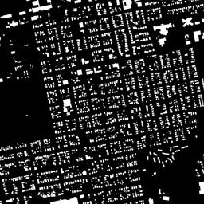
        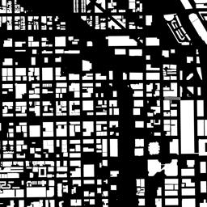
        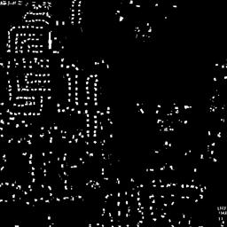
        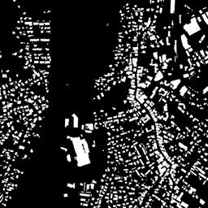
        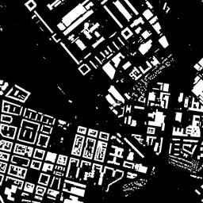
    

    Generated images:
    

        
        
        
        
        
    

    Ground truth satellite images:
    

        
        
        
        
        
    

In general, the model performs acceptably well when the mask is almost full of annotated buildings. Few checkerboard effects are shown. In masks with big empty non labelled spaces (woods, large roads, ...) it defaults to a mixture of grey (for roads) and green (for trees) unshaped forms.

<a href="#toc">To top</a>

# The quest for improving the results 
With a LR of 0.0002 and a lambda of 100 we had a good baseline to improve the results. Many options were at hand:

- Splitting the training images would allow the model to learn more detailed information from the satellite pictures: cars, trees, ...
- Using [instance normalization](https://medium.com/syncedreview/facebook-ai-proposes-group-normalization-alternative-to-batch-normalization-fb0699bffae7) instead of batch normalization
- Training the model with 512x512 images instead of 256x256 ones
- Using a different content loss, like [VGG Loss](https://paperswithcode.com/method/vgg-loss), to let the model learn a more perceptual similarity generation
- Use the [ReduceLROnPlateau](https://pytorch.org/docs/stable/optim.html#torch.optim.lr_scheduler.ReduceLROnPlateau) scheduler

## Modifying the dataset to get more details 
XXX Progressive training XXX

The results obtained in our best trainings were far from detailed. The model is originally conceived to receive and produce 256x256 images and we trained it with resized 286x286 images from the 5.000x5.000 originals. That meant we were reducing by 306 times the original images and masks.

So we made up two new datasets splitting the original images and masks into smaller squares. In one of them, from a couple of a 5.000x5.000 image and mask, we obtained 25 1.000x1.000 images and masks. When resized to 286x286, they were only 12 times smaller. That would allow the model to learn more details from the images at the cost of having 25 times more images to process. The new dataset was also already resized and normalized, as explained [before](#datasetaccess). The second dataset performed the same operation dividing all the images by 2x2, obtaining 4 2.500x2.500 tiles from each image and mask.

25 times more images would mean spending 5 minutes and a half for every epoch. That is 9 hours for 100 epochs in Google Colab, way too much for the limits the free platform offers. So we decided to create a Google Cloud instance to overcome the usage limits of Colab. You can find more details about the instance in a [later section](#gcinstance).

### First tests with the 2x2 dataset
As a first test we used the dataset created by splitting masks and images by 2x2, obtaining 540 training 2.500x2.500 couples, 120 validation couples and leaving 60 couples for validation. We spent some time to find the best combination of parameters for speed (data loader threads, batch and validation batch sizes). A surprise was awaiting: if we could train our baseline model on Colab spending 13 seconds per epoch, we expected to obtain around 52 sec/epoch with 540 couples, but instead every epoch lasted 97 seconds in our new shining cloud environment. We made a 900 epoch training anyway, which lasted almost 25 hours at a cost of around 16€.

The avg. PSNR and losses obtained were similar to our baseline model training, even if the final avg. PSNR was lower:

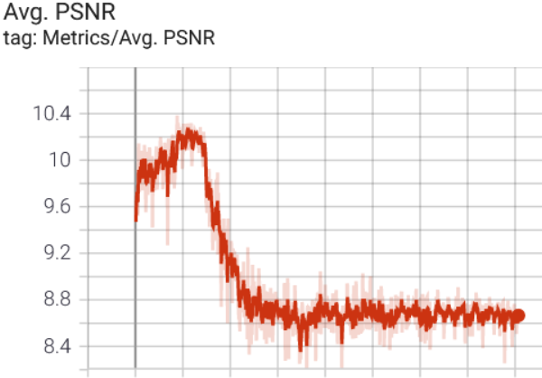 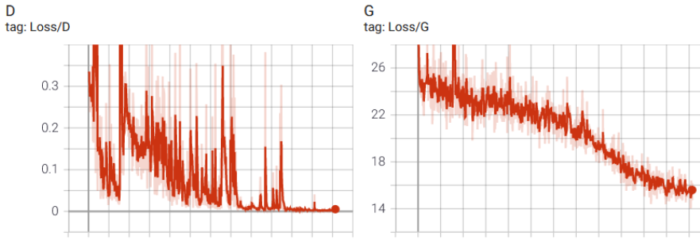

Although the intermediate results recorded in tensorboard were promising, the validation images generated showed color problems. We generated two sets of images: one feeding the whole mask to produce a single 256x256 image:

    Generated images:
    

        
        
        
        
        
    

    Ground truth satellite images:
    

        
        
        
        
        
    

In the second set we split the mask into 4 tiles, resizing them to 256x256. Thus we generated 4 256x256 splits for every image. The color problems also showed up in that case.

    Masks:
    

        

            
            
            &nbsp;
            
            
            &nbsp;
            
            
            &nbsp;
            
            
            &nbsp;
            
            
        

        

            
            
            &nbsp;
            
            
            &nbsp;
            
            
            &nbsp;
            
            
            &nbsp;
            
            
        

    

    Generated images:
    

        

            
            
            &nbsp;
            
            
            &nbsp;
            
            
            &nbsp;
            
            
            &nbsp;
            
            
        

        

            
            
            &nbsp;
            
            
            &nbsp;
            
            
            &nbsp;
            
            
            &nbsp;
            
            
        

    

    Ground truth satellite images:
    

        

            
            
            &nbsp;
            
            
            &nbsp;
            
            
            &nbsp;
            
            
            &nbsp;
            
            
        

        

            
            
            &nbsp;
            
            
            &nbsp;
            
            
            &nbsp;
            
            
            &nbsp;
            
            
        

    

For the sake of comparison, we generated 2x2 tiles with our baseline model using the same validation masks and found that one of the Vienna29 (rightmost) tiles already showed a fluorescent effect:

    

        
        
        &nbsp;
        
        
        &nbsp;
        
        
        &nbsp;
        
        
        &nbsp;
        
        
    

    

        
        
        &nbsp;
        
        
        &nbsp;
        
        
        &nbsp;
        
        
        &nbsp;
        
        
    

Some checkerboard effects can be seen when generating from big empty (non-labelled) spaces.

### Training from baseline 

To avoid the color effects when training with the 2x2 split dataset from scratch, we tried several trainings loading the already pretrained baseline model (where fullsize images were used). To obtain a quick glimpse on whether the path taken could offer good results, we used a reduced dataset of 140 tiles (from 2x2 splits, 28 tiles from each city) and only 200 epochs. With batch normalization, colors suffered as in the training with 540 tiles for 900 epoch from scratch:

    

        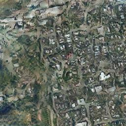
        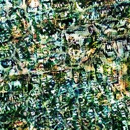
        &nbsp;
        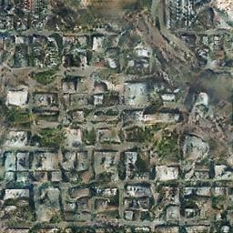
        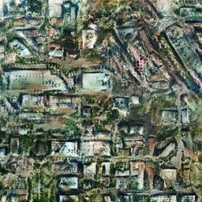
        &nbsp;
        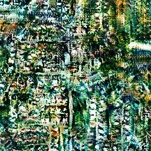
        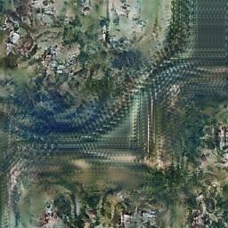
        &nbsp;
        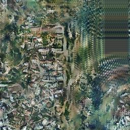
        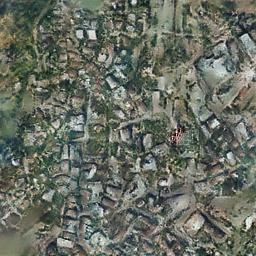
        &nbsp;
        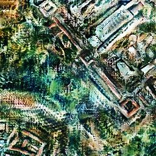
        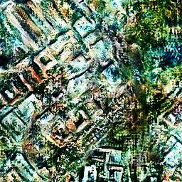
    

    

        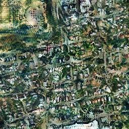
        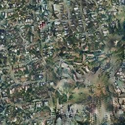
        &nbsp;
        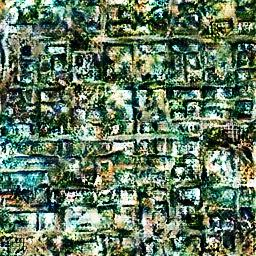
        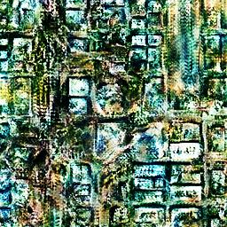
        &nbsp;
        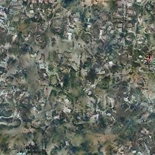
        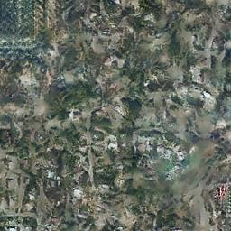
        &nbsp;
        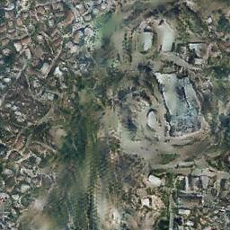
        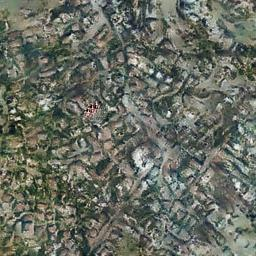
        &nbsp;
        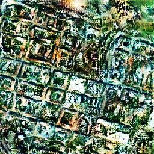
        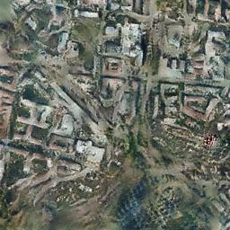
    

 A part from the fluorescent colors problem, more checkerboard effects can ben seen even in dense city tiles when compared with the 2x2 tiles generated with the baseline model.

 Using fullsized masks also showed color problems, and the resulting imges were frankly worse:

 

    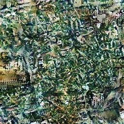
    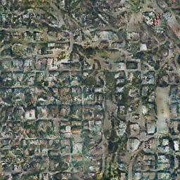
    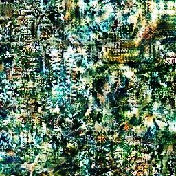
    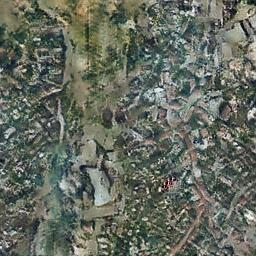
    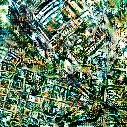

## Instance normalization 

[Instance normalization was successfully used in style transferring between images](https://arxiv.org/abs/1607.08022), improving the results of feed-forward generative models by simply replacing the existing batch normalization layers. Batch normalization affects a whole batch, while instance normalization is performed picture by picture, the result being independent on which images compose the batch:

[_Image source_](https://medium.com/syncedreview/facebook-ai-proposes-group-normalization-alternative-to-batch-normalization-fb0699bffae7)

To give it a try we built a generator substituting all the batch normalization layers by instance normalization ones and trained the model against the same 135 full sized images of our baseline model. We used the same hyperparameters (learning rate, lambda, epochs, ...) used to train the baseline model. The control images seemed a little worse than those from our baseline model, but the validation ones had better defined building shapes. The non labelled areas showed less defined colors. It was remarkable that colors seemed more consistent than in the baseline (no slight tendency to show fluorescent colors). Images generated with full sized validation masks follow:

    
    
    
    
    

When generating images with split 2x2 masks:

    

        
        
        &nbsp;
        
        
        &nbsp;
        
        
        &nbsp;
        
        
        &nbsp;
        
        
    

    

        
        
        &nbsp;
        
        
        &nbsp;
        
        
        &nbsp;
        
        
        &nbsp;
        
        
    

In this second set of images non labelled areas show more grain effects. So it seems that colors are more stable, but the appearence looses a bit of realism.

The shape of the avg. PSNR and the losses were similar to those from the baseline model:

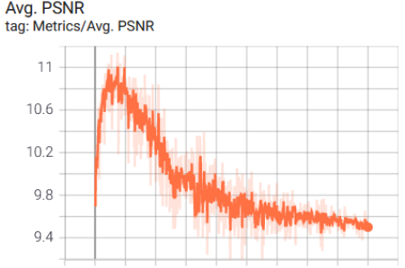 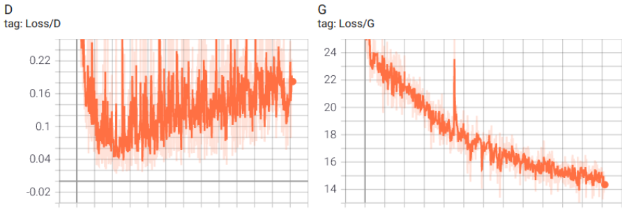

So it seemed that substituting batch normalization by instance normalization gave us a better color control at the cost of a slightly slower training time and more checkerboard effects in non labelled areas.

### Further training with the 2x2 dataset

Once we had a new baseline model (which we will call our instance norm baseline), we tried again to train it further with the 2x2 tiles dataset. Our hope was to obtain more detailed generated images. As with our [batch normalization try](#frombaseline), we used the same reduced dataset composed of 140 tiles and trained the instance norm baseline for 200 more epochs.

The results showed that a change in the resolution of the images caused the model to relearn patterns. The images obtained were very similar to the control images we found in TensorBoard in early stages of the baseline models training. That was something we could also see when training the (batch norm) baseline model 200 more epochs with 2x2 splits. And thus it seemed there was no benefit from using a pretrained model and train it with "zoomed in" images. Perhaps with more epochs the model could learn the extra details, but we doubted that this strategy was any better than training the model from scratch.

Below you can see a comparison between the images obtained with the baseline model (left), the intance norm baseline (center) and the training try (right):

    

        
        
        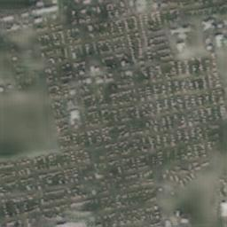
    

    

        
        
        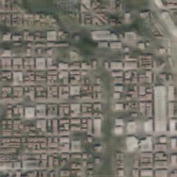
    

    

        
        
        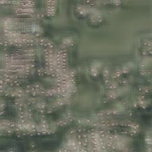
    

    

        
        
        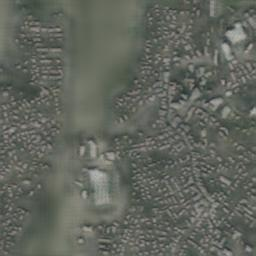
    

    

        
        
        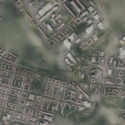
    

## Feeding bigger images 

As our attempts to improve the quality of images training both the baseline model and the instance norm base model with 2x2 split images failed, we tried to feed bigger images directly to the model.

Our chosen pix2pix implementation, in training time, resizes images to 286x286 and, from there, crops them to 256x256. So, the generator is trained to accept 256x256 masks and output 256x256 satellite alike images. We decided to train the model using instance normalization resizing full images (no splitting) to 542x542 and cropping from them a 512x512 portion. That meant every content layer of the model would use 4 times more space to learn details of the images.

Our first tests with few images and epochs showed that the model could learn more details. Of course, that had a cost: both the train and the validation (test) batch size had to be divided by 4 to avoid a memory overflow. We decided to go ahead with a training with parameters as close to the instance norm baseline training: 900 epochs with 135 training images, 30 validation images, batch size of 4, validation (test) batch size of 2, instance normalization (to avoid color issues), a learning rate of 0.0002 and a lambda of 100. We used Colab again (the Google Cloud instance was training with 25x25 splits) and training epochs took between 30 and 58 seconds in 4 different runs (4 days of about 3 hours of training each one).

The training showed that the shapes of the avg. PSNR and the losses could be similar to those of our baseline trainings, being the avg. PSNR slightly higher:

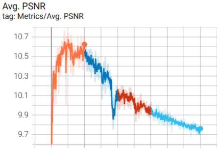 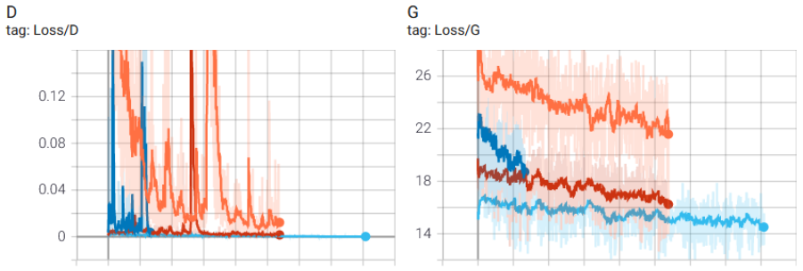

The losses representation suffers from some bugs in its calculus when several trainings are enchained, but it can be seen that it has a descending trend over epochs. The control images showed that the model wasn't able to generate better images from a human perception perspective. The images generated from test masks (not seen by the model) confirmed that hypothesis (click them to see them in their original resolution):

    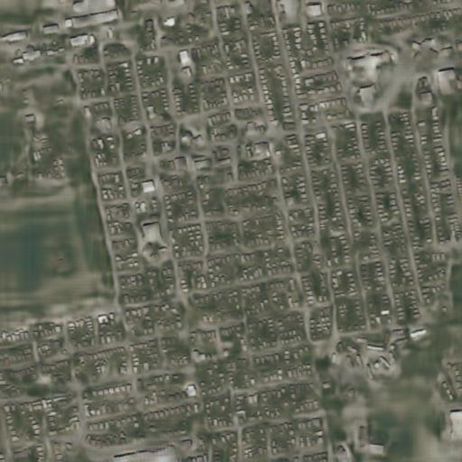
    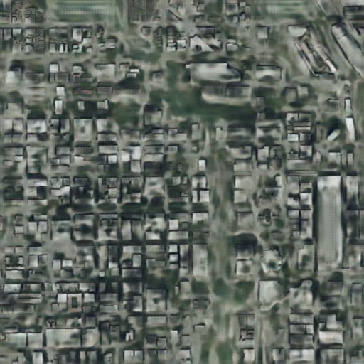
    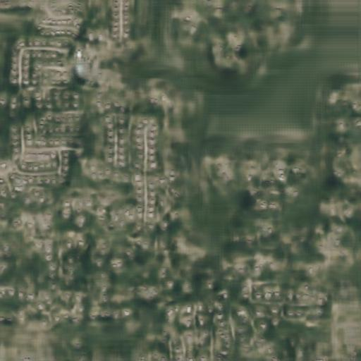
    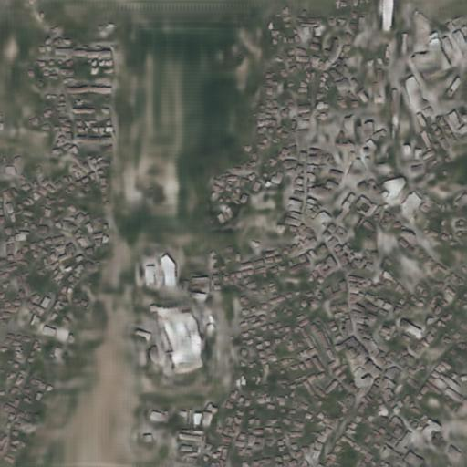
    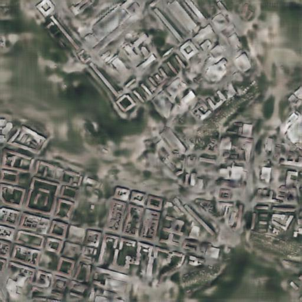

Comparing with instance normalization baseline generations:

    
    
    
    
    

While the buildings seem less defined than in the 256x256 training, the non-labelled areas suffer from a much less realistic mix of green and grey (trees and roads) forms. On the other hand, no checkerboard effect is appreciated. Perhaps using bigger images requir more epochs to let the model capture high frequency details. That extra cost has to be considered a part from a already slower training compared to using 256x256 input images.

## VGG Loss 

Another strategy to improve the quality of the generated images could be replacing our L1 content loss by the [VGG loss](https://paperswithcode.com/method/vgg-loss).

To calculate the VGG loss, a VGG model pretrained on ImageNet classification is used. In the generator training phase, the L1 loss used to compare the generated satellite image and the ground truth satellite image is substituted by a comparison between the classification labels issued by the VGG model between the same both satellite images (generated and GT). The inctuition behind this is that if both images are similar, the labels and confidence scores resulting from the inference of the VGG network will also be similar.

The first results didn't improve apparently those from our baseline training.

**To be continued... XXX**

## Using the ReduceLROnPlateau scheduler 

One of the changes we tried in order to overcome the loose of color precision was using a [ReduceLROnPlateau](https://pytorch.org/docs/stable/optim.html#torch.optim.lr_scheduler.ReduceLROnPlateau) scheduler instead of a LambdaLR one. Pix2pix uses two schedulers: one for the generator and one for the discriminator. ReduceLROnPlateau needs the losses to decide when to change the learning rate, so we fed the generator loss to its scheduler and the discriminator loss to its own scheduler. The result was a disaster: the LR fell down to 0 in few epochs:

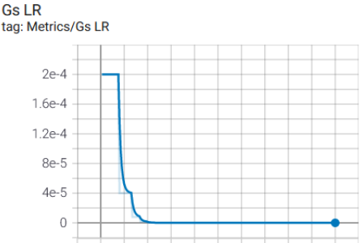 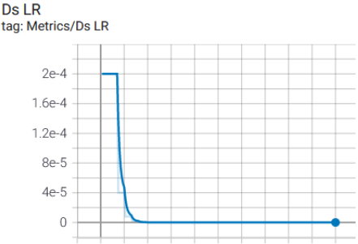

<a href="#toc">To top</a>

# The Google Cloud instance 

Google Colab is a great development and testing environment for deep learning applications. It gives you access to a machine with a GPU, the Jupyter based environment makes it very easy to mix code, text or images, ... and it's free!!  But it has its limits. When long trainings come, Colab limits the use of GPUs. More than 3 hours per day of intensive use of a GPU will get you to a "you're a naughty boy/girl" message (remember it is free). And what is more important, most production environments for training or inferencing are not Colab or Jupyter based.

Both reasons were enough to follow the advice of our lecturers to create a [Google Cloud](https://cloud.google.com/) instance. As recommended, we opted for a Deep Learning VM instance with 2 CPUs, 13GB of RAM and an instance of a NVIDIA Tesla K80 GPU with 12GB of memory. To preinstall PyTorch 1.7 at least 50GB of disk are needed. We made a [log](infrastructures/GoogleCloudSetup.pdf) of most of the steps we made to make it work, including billing setup, permissions to all members of the team, gcloud command line tool installation, ... Don't expect it to be neither a manual nor a organised step by step guide.

## Pros and cons 

So we had a shiny new cloud environment with no time limitations and we began using it. Soon we realized it wasn't a marvellous solution:

- **It is slower than Colab**: our first serious training (540 images coming from splitting by 2x2 the 135 full images we used in our baseline training) showed that every epoch lasted 104 seconds instead of the 52 seconds we expected (even using a bigger batch size). As all the images were stored in memory, disk access shouldn't be the problem. The CPU didn't seem busy, so we considered it coped feeding the GPU in time. The result was that training 900 epochs lasted almost 25 hours compared to the 3 hours it lasted the baseline training.
- **It costs money**: no surprise here. The good news is that the first time you use Google Cloud you're awarded 300€ to test their services. As a reference, our 25 hour training costed 16€.

So, why use the instance? Here are some reasons:
- **Production experience**: the instance gives us the oportunity to adapt the code to a production alike environment. Well, we're sure it is still a simple environment (single instance, no shared storage, no REST APIs exposed), but it is a step forward compared to sticking to Google Colab.
- **No time limit**: it allowes us running long trainings as a batch job, with no care about the limits of Colab or maintaining the session alive. The lack of time limits gives us more freedom, but money limits are still there.

