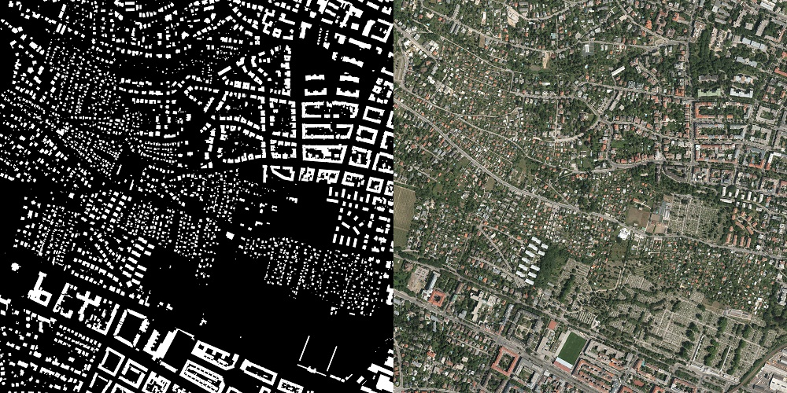

# Generation of satellite alike images with a conditional GAN

Final Project for the UPC [Artificial Intelligence with Deep Learning Postgraduate Course](https://www.talent.upc.edu/ing/estudis/formacio/curs/310402/postgraduate-course-artificial-intelligence-deep-learning/) 2020-2021 edition, authored by:

* [Luisa Fleta](https://www.linkedin.com/in/luisa-fleta-5a010422/)
* [Darío Cortizo](https://www.linkedin.com/in/dariocortizo/)
* [Diego Tascón](https://www.linkedin.com/in/diego-tascon-9139297/)

Advised by professor [Eva Mohedano](https://www.linkedin.com/in/eva-mohedano-261b6889/)

## Table of Contents 

1. [Introduction](#intro)
    1. [Motivation](#motivation)
    2. [Milestones](#milestones)
2. [The data set](#datasets)
3. [Working Environment](#working_env)
4. [General Architecture](#architecture)
5. [Preliminary Tests](#preliminary)
    1. [Initial models](#initial)
    2. [Model baseline with ResNet](#visionbaseline)
    3. [Is the model actually learning something?](#learning)
    4. [How important is to train only classifier vs train also vision?](#important)
    5. [Classifier Architecture](#classifier)
    6. [Training results visualization](#resultsvisualization)    
6. [Splitting the model](#splitting)
7. [Final Tests](#final)
    1. [Baseline Model on the 100k Dataset](#guse)
    2. [Training the Question Channel](#question)
        1. [Word Embedding + LSTM](#lstm)
        2. [GloVe LSTM](#glove)
     3. [Results Summary](#resultssummary)
8. [Result analysis](#results)
    1. [Accuracies by question type (*best accuracies excluding yes/no questions*)](#best)
    2. [Accuracies by question type (*worst accuracies excluding yes/no questions*)](#worst)
    3. [Interesting samples](#interestingsamples)
9. [Conclusions and Lessons Learned](#conclusions)
10. [Next steps](#next_steps)
11. [References](#references)
12. [Additional samples](#samples)

# Introduction 
Generative Adversarial Networks (GANs) were introduced by [Ian Goodfellow et al.](https://papers.nips.cc/paper/5423-generative-adversarial-nets) in 2014. GANs can make up realistic new samples from the distribution of images learned.

Conditional GANs (cGANs) where introduced by [Mehdi Mirza and Simon Osindero](https://arxiv.org/abs/1411.1784) also in 2014. cGANs allow directing the results generated using class labels, a part of data for impainting or data from other modalities. One of the most famous implementations of cGANs is [pix2pix](https://phillipi.github.io/pix2pix/).

In this project we're exploring the possibilities of applying conditional GANs to generate realistic satellite alike images.

## Motivation 
<to be written>
We have decided to do this project because we considered that being able to answer a question from an image using AI it's 'cool' and, more importantly, it is a project that due to the multimodal approach requires that you must understand two of the most important disciplines in AI-DL: vision and language processing.

In addition it's a relatively new area (papers from 2014, 2015, ...) with plenty of opportunities for improvement and several possible business applications: 
* Image retrieval - Product search in digital catalogs (e.g: Amazon)
* Human-computer interaction (e.g.: Ask to a camera the weather)
* Intelligence Analysis
* Support visually impaired individuals

<a href="#toc">To top</a>

## Milestones 
- Build a base model
- Discuss possible model improvements
- Tune/Improve base model
- Final model

<a href="#toc">To top</a>

# The data set 

The [Inria Aerial Image Labeling Dataset](https://project.inria.fr/aerialimagelabeling/) provides in its training set 180 satellite images and their corresponding masks. All the images and masks have a resolution of 5000x5000 and are stored in TIFF format. Satellite images have 3 channels whilst their corresponding masks have only one channel. The masks label the buildings in the area:

There are also available 180 test images. Since they lack their corresponding mask, they would only be useful if extracting masks from satellite images, which would be the opposite direction of our work.

The training images were taken from 5 cities with different landscapes: Austin, Chicago, Kitsap, Tyrol and Vienna.

The whole training set is 15GB of space, as satellite images are 72MB each one and masks are around 1MB of size. As the model performed some transformations to each file, a pretransformed dataset was generated to accelerate the training process. Details on the procedure can be found in section [Splitting the model](#splitting).

<a href="#toc">To top</a>

# Working environment 
We have developed the project using [Google Colab](https://colab.research.google.com/), which gave us easy and free access to GPUs. We've used both local Colab and Google Drive storage. For some parts, though, we've also used a local python container based on the offical [Docker Hub image](https://hub.docker.com/_/python).

  

<a href="#toc">To top</a>

# General Architecture 
We've implemented a pix2pix model using [PyTorch](https://pytorch.org/). Although the creators of pix2pix have a published [PyTorch implementation](https://github.com/junyanz/pytorch-CycleGAN-and-pix2pix), as it combines both a CycleGAN and pix2pix, we started on a simpler implementation by [mrzhu](https://github.com/mrzhu-cool/pix2pix-pytorch).

The architecture of pix2pix is similar to that described for the original conditional GAN:

  

The generator is implemented with a U-Net of ResNet blocks:

  

The discriminator is implemented with a XXX:

 Image to be provided 

<a href="#toc">To top</a>
