# Generation of satellite alike images with a conditional GAN

Final Project for the UPC [Artificial Intelligence with Deep Learning Postgraduate Course](https://www.talent.upc.edu/ing/estudis/formacio/curs/310402/postgraduate-course-artificial-intelligence-deep-learning/) 2020-2021 edition, authored by:

* [Luisa Fleta](https://www.linkedin.com/in/luisa-fleta-5a010422/)
* [Darío Cortizo](https://www.linkedin.com/in/dariocortizo/)
* [Diego Tascón](https://www.linkedin.com/in/diego-tascon-9139297/)

Advised by professor [Eva Mohedano](https://www.linkedin.com/in/eva-mohedano-261b6889/)

## Table of Contents 

1. [Introduction](#intro)
    1. [Motivation](#motivation)
    2. [Milestones](#milestones)
2. [The data set](#datasets)
3. [Working Environment](#working_env)
4. [General Architecture](#architecture)
    1. [Main hyperparameters](#mainhyperp)
    2. [Metrics and loss criterions](#metricsandloss)
5. [Preliminary Tests](#preliminary)
    1. [First steps](#initial)
    2. [Accessing the dataset](#datasetaccess)
    3. [Finding the right parameters](#parameters)
    4. [Does the discriminator help?](#nodiscriminator)
6. [The quest for improving the results](#improvingresults)
    1. [Changing the resolution of images](#changeresolution)
        1. [Resolutions](#resolutions)
        2. [Mid resolution](#midresolution)
        3. [High resolution](#highresolution)
    2. [Instance Normalization](#instancenorm)
    3. [Focusing on labelled areas](#labelfocus)
    4. [VGG Loss](#vggloss)
    5. [Using the ReduceLROnPlateau scheduler](#plateau)
7. [Quality metrics](#qualitymetrics)
    1. [Fréchet Inception Distance](#frechet)
8. [The Google Cloud instance](#gcinstance)
9. [Conclusions and Lessons Learned](#conclusions)
10. [Next steps](#next_steps)

# 1. Introduction 
Generative Adversarial Networks (GANs) were introduced by [Ian Goodfellow et al.](https://papers.nips.cc/paper/5423-generative-adversarial-nets) in 2014. GANs can make up realistic new samples from the distribution of images learned.

Conditional GANs (cGANs) where introduced by [Mehdi Mirza and Simon Osindero](https://arxiv.org/abs/1411.1784) also in 2014. cGANs allow directing the results generated using class labels, a part of data for impainting or data from other modalities. One of the most famous implementations of cGANs is [pix2pix](https://phillipi.github.io/pix2pix/).

In this project we're exploring the possibilities of applying conditional GANs to generate realistic satellite alike images.

## 1.i. Motivation 

Conditional GANs offer multiple applications for generating tailored images in a target domain. Using them with satellite images sounded attractive and has a practical use case. Annotating images, specially aerial ones, is a hard and very time consuming task. So a cGAN trained to generate images from forged masks can help increasing the size of aerial datasets.

<a href="#toc">To top</a>

## 1.ii. Milestones 

The main milestones throughout this project were:
- Build a base model from an off-the-shelf implementation
- Train it with the chosen dataset, finding a good set of parameters
- Discuss possible model improvements
- Tune/Improve the base model
- Extract conclusions about the different improvements attempted

<a href="#toc">To top</a>

# 2. The data set 

The [Inria Aerial Image Labeling Dataset](https://project.inria.fr/aerialimagelabeling/) provides in its training set 180 satellite images and their corresponding masks. All the images and masks have a resolution of 5000x5000 and are stored in TIFF format. Satellite images have 3 channels whilst their corresponding masks have only one channel. The masks label the buildings in the area:

There are also available 180 test images. Since they lack their corresponding mask, they would only be useful if extracting masks from satellite images, which would be the opposite direction of our work.

The training images were taken from 5 cities with different landscapes: Austin, Chicago, Kitsap, Tyrol and Vienna.

The whole training set is 15GB of space. Satellite images are 72MB each one and masks are around 1MB of size. As the model performed some transformations to each file, we generated a pretransformed dataset to accelerate the training process. Details on the procedure can be found in section [Accessing the dataset](#datasetaccess).

<a href="#toc">To top</a>

# 3. Working environment 
We have developed the project using [Google Colab](https://colab.research.google.com/), which gave us easy and free access to GPUs. We've used both local Colab and Google Drive storage. For some parts, though, we've also used a local python container based on the offical [Docker Hub image](https://hub.docker.com/_/python). We've also created a [Google Cloud](https://cloud.google.com/) Deep Learning VM instance for longer trainings.

   

<a href="#toc">To top</a>

# 4. General Architecture 
We've implemented a pix2pix model using [PyTorch](https://pytorch.org/). Although the creators of pix2pix have a published [PyTorch implementation](https://github.com/junyanz/pytorch-CycleGAN-and-pix2pix), as it combines both a CycleGAN and a pix2pix implementation, we started on a simpler one by [mrzhu](https://github.com/mrzhu-cool/pix2pix-pytorch).

The architecture of pix2pix is similar to that described for the original conditional GAN:

The generator is implemented with a U-Net of ResNet blocks:

The discriminator is implemented with a PatchGAN, a fully convolutional network designed to classify patches of an input image as real or fake, allowing to capture more details from the image. As the discriminator acts as a loss, two images are fed into this network:

 

_Note: hence in the chosen implementation, the author calculates an average PSNR metric against a so called "test" dataset. It can be thought as a validation dataset, although in the code you'll find references to a test phase, a testing data loader and so on. In the original pix2pix implementation there's no validation stage. A test script was provided to see the quality of results after a training was done_

<a href="#toc">To top</a>

## 4.i. Main hyperparameters 

The picked pix2pix implementation can be trained choosing several hyperparameters. We played with a handful of them:

Name | Comments
---- | --------
Learning Rate | Experiment were carried out with values between 0.0002 and 0.002 
Lambda | Weight factor for the content loss. Value must be 0 or positive, usually an integer. See detailed explanation below __*__.
Train Batch Size | Resources constrained the maximum batch size to 16. Several experiments used batch sizes of 2.
Test Batch Size | Used in the validation (called "test") stage. Values ranged between 1 and 8.
Threads | For taking advantage of multithreading during training. Only used in Google Cloud VM experiments (threads = 4).

__*__ _What is the purpose of the lambda hyperparameter?_ When training the generator, the pix2pix implementation combines two losses: one generated by the discriminator predicting whether the generated image seems real or fake (if it is plausible) considering the mask provided and a second loss comparing the generated image with the ground truth through a L1 loss. The lambda parameter determines the weight of the L1 loss (they're simply multiplied) when combining both to calculate the generator's loss. There's a nice explanation with more details in [this article](https://machinelearningmastery.com/a-gentle-introduction-to-pix2pix-generative-adversarial-network/).

<a href="#toc">To top</a>

## 4.ii. Metrics and loss criterions 

Three different formulas are in play depending on the architecture being trained or if validation is being performed.

1. Generator Loss: 
2. Discriminator Loss: 
3. Validation Criterion: 

For further explanation of the PSNR formula, refer to the following [article](https://en.wikipedia.org/wiki/Peak_signal-to-noise_ratio).

<a href="#toc">To top</a>

# 5. Preliminary Tests 
## 5.i. First steps 
Our first steps with the chosen implementation were to understand it, compare it with the original pix2pix implementation and prepare a [Colab notebook](colab_notebooks/01_TrainOriginalImages.ipynb) to test the code. We incorporated access to our Google Drive account, logging to Tensorboard and basic debugging outputs.

## 5.ii. Accessing the dataset 
Understanding how to access the dataset was crucial. We followed the recommendations from [this article](https://towardsdatascience.com/preparing-tiff-images-for-image-translation-with-pix2pix-f56fa1e937cb) to discover that the TIFF masks had only one channel and their values were held in a [0:255] range, as PNG or JPEG images. Moreover, the picked implementation transformed the images, both satellite ones and masks, to RGB (adding 2 channels to the masks), so we didn't have to treat the dataset in a special way.

After feeling confortable with short trainings (10 or 20 epochs, 20 images) we started to make longer ones (300 epochs, 115 images), and that revealed a weakness of our model: every epoch could take up to 6 minutes. That resulted in 30 hours of training. Soon, Colab started complaining about our abuse of GPU usage. So we had to make something about it.

The dataset class [DatasetFromFolder](dataset.py) read the 72MB satellite image and the 1MB corresponding mask in every epoch, converted to RGB, resized them to 286x286 images, transformed them to a torch tensor, normalized their values, made a 256x256 random crop and a random flip. Most of that work could be done previously and only once. So we made a [script](transform-dataset.py) to pretransform all the masks and images to 286x286 with normalized values and save them to .npy numpy array files. We also adapted the DatasetFromFolder class to read the new files, transform them into torch tensors to random crop and random flip them. A training epoch then lasted only 13 seconds!

_Note: in fact, pytorch tensors could be saved directly into .pt files and save some more CPU. When we realized it was possible, most of our research was already done, so we didn't try it. The savings are minimal. Once read from disk, we store the already transformed pytorch tensors in memory, so from epoch 2 no access to disk is done (except for TensorBoard and checkpoints)._

<a href="#toc">To top</a>

## 5.iii. Finding the right parameters 
Once we were able to train 900 epochs in down to 3 hours having 135 images for training (27 from each city) and 30 for validating, we started to run different trainings in order to understand the influence of the chosen parameters and find a good combination of them.

We began playing with the learning rate and the lambda, leaving untouched other possibilities like the learning rate policy. We left untouched also parameters that affected the structure of the model like the type of normalization or the number of filters in the first convolutional layer.

The losses from both the generator and the discriminator served us as a guide to what was happening with the model. Plus, in every epoch an average [PSNR](https://en.wikipedia.org/wiki/Peak_signal-to-noise_ratio) is calculated using the validation images.

We started rising the original learning rate of 0.0002 to 0.002 trying to boost the learning process, but that collapsed the training: the generator only produced blank images. A too high learning rate was probably exploding gradients. The avg PSNR acted as a canary of the moment the training collapsed:

Other values tested for the learning rate (0.0001, 0.0003, 0.001) didn't improve the quality of the obtained images. That wasn't he case of the lambda.

We found that the lambda had a bigger influence in the capacity of the model to learn. With the standard lambda of 10, the model losses flattened after few epochs:

On the other hand, larger lambda values of 25, 50 and 100 helped the model to improve the quality of images proportionally to the number of epochs:

Regarding losses we found that even if the discriminator's loss rised a bit, if the generator's loss descended in a continuos manner then the quality of the images produced would be better. The avg. PSNR hadn't any correspondance with the perceptual quality of images. The PSNR tended to peak between epoch 100 and 200 in different trainings and the images produced in those stages were just horrible:

In the following images it can be appreciated that the longer the training, the better the images, despite what could be deduced from the PSNR graphs. On the left the labelled mask is shown while on the right the generated image (from the training set) is shown in epoch 400:

...and in epoch 900:

In the following table you can see the hyperparameters we played with and some comments about their values:

Hyperparameters | Values | Comments
--------------- | ------ | --------
Learning rate (LR) | 0.0002 | This default value gave us the best results
LR | 0.002 | A 10x learning rate collapsed the training
LR | 0.0001, 0.0003, 0.001 | Slighly increasing or decreasing the LR sistematically poored down the generated images
Lambda | 10 | With the default lambda value the learning progress dropped down in few epochs
Lambda | 1, 2 | Low lambda values resulted in poor training results
Lambda | 25, 50, 100 | High lambda values helped the model learn the dataset details
Epochs | 900 | This value gave us a good compromise between quality results and spent resources
Epochs | 200, 500 | Lower epochs helped us to see trends, but the quality of the images obtained was low

So we found that a LR of 0.0002, lambda 100 and training for 900 epochs a set of 135 images (27 per city) generated reasonable decent images with our test masks. Thus, we considered it our baseline model:

    Masks for Austin29, Chicago29, Kitsap29, Tyrol-w29 and Vienna29:
    

        
        
        
        
        
    

    Generated images:
    

        
        
        
        
        
    

    Ground truth satellite images:
    

        
        
        
        
        
    

In general, the model performs acceptably well when the mask is almost full of annotated buildings. Few checkerboard effects are shown. In masks with big empty non labelled spaces (woods, large roads, ...) it defaults to a mixture of grey (for roads) and green (for trees) unshaped forms.

<a href="#toc">To top</a>

## 5.iv. Does the discriminator help? 

Once we had a working cGAN, a question arose: if we're just trying to map images from one domain (labelled masks) to another (satellite images), does the extra burden of having a discriminator pay off? Papers tell so, but we made a test to prove it with our dataset. So we [built a model](model_variations/generator_alone) removing the discriminator. As a loss we left the L1 * lambda content loss, which compared the generated image with the ground truth. We trained the model with the same parameters as the previous one: 900 epochs, a learning rate of 0.0002, lambda of 100. We used our [Google Cloud instance](gcinstance) to train, which lasted 04:27:43 for less than 1€.

The metrics showed similar to the previous training, with a higher final PSNR and a lower loss:

 

Generating images with the validation masks, though, showed worse perceptual results. Both buildings and non-labelled areas appear less defined, and even some of the images show fluorescent colors:

    
    
    
    
    

As a conclusion, the discriminator really helps improving the quality of the generated images at a relatively low cost.

<a href="#toc">To top</a>

# 6. The quest for improving the results 
With a LR of 0.0002 and a lambda of 100 we had a good baseline to improve the results. Many options were at hand:

- Changing the resolution of the training images would allow the model to learn more detailed information from the satellite pictures: cars, trees, ...
- Using a different network normalization, like using [instance normalization](https://medium.com/syncedreview/facebook-ai-proposes-group-normalization-alternative-to-batch-normalization-fb0699bffae7) instead of batch normalization
- Focusing on labelled areas: filtering masks based on pixel content and grouping images on label density
- Using a different regularization content loss, like [VGG Loss](https://paperswithcode.com/method/vgg-loss), to let the model learn a more perceptual similarity generation
- Use the [ReduceLROnPlateau](https://pytorch.org/docs/stable/optim.html#torch.optim.lr_scheduler.ReduceLROnPlateau) scheduler

<a href="#toc">To top</a>

## 6.i. Changing the resolution of images 

The results obtained in our best trainings were far from detailed. The model is originally conceived to receive and produce 256x256 images and we trained it with resized 286x286 images from the 5000x5000 originals. That meant we were reducing by 306 times the area of original images and masks. It also meant that if the original satellite images had a resolution of 0.3 meters per pixel, when resized to 286x286 the resolution changed to 5.25 m/px, loosing a lot of detail along the way.

To diminish the resolution loose we tried two strategies: splitting the images and resizing to a bigger size.

So we made up two new datasets splitting the original images and masks into smaller squares. In one of them, from a couple of a 5000x5000 image and mask, we obtained 25 1000x1000 images and masks. Resizing them to 286x286 resulted in images with a resolution of 1.05 m/px, which we hoped would help the model to learn more details from the images (at the cost of having 25 times more images to process). The new dataset was also resized and normalized, as explained [before](#datasetaccess). The second dataset performed the same operation dividing all the images by 2x2, obtaining 4 2500x2500 tiles from each image and mask.

For the second strategy we prepared a new dataset resizing the original images and masks to 542x542.

The following table briefs the datasets used throughout the tests:

Dataset name | Pixel resolution (m/px) | Image size | Extracted crops | # Training images | # Validation images
------------ | ----------------------- | ---------- | --------------- | ----------------- | -------------------
Original INRIA | 0.3 | 5000x5000 | - | 180 | -
Low resolution | 5.25 | 286x286 | 256x256 | 135 | 30
Mid resolution 2x2 | 2.62 | 286x286 | 256x256 | 540 | 120
Mid resolution full | 2.77 | 542x542 | 512x512 | 135 | 30
High resolution 5x5 | 1.05 | 286x286 | 256x256 | 3375 | 750

When using the high resolution dataset, 25 times more images would mean spending 5 minutes and a half for every epoch. That is 9 hours for 100 epochs in Google Colab, way too much for the limits the free platform offers. So we decided to create a Google Cloud instance to overcome the usage limits of Colab. More details about the instance can be found in a [later section](#gcinstance).

<a href="#toc">To top</a>

### 6.i.a. Mid resolution 

#### From scratch 
As a first test we used the Mid resolution 2x2 dataset. We spent some time to find the best combination of parameters for speed (data loader threads, batch and validation batch sizes) in the Google Cloud instance. A surprise was awaiting: if we could train our baseline model on Colab spending 13 seconds per epoch, we expected to obtain around 52 sec/epoch with 540 couples, but instead every epoch lasted 97 seconds in our new shining cloud environment. We made a 900 epoch training anyway, which lasted almost 25 hours at a cost of around 16€.

Although the intermediate results recorded in tensorboard were promising, the validation images generated showed color problems. We generated two sets of images: one feeding the whole mask to produce a single 256x256 image:

    Generated images:
    

        
        
        
        
        
    

    Ground truth satellite images:
    

        
        
        
        
        
    

In the second set we split the mask into 4 tiles, resizing them to 256x256. Thus we generated 4 256x256 splits for every image. The color problems also showed up in that case.

    Masks:
    

        

            
            
            &nbsp;
            
            
            &nbsp;
            
            
            &nbsp;
            
            
            &nbsp;
            
            
        

        

            
            
            &nbsp;
            
            
            &nbsp;
            
            
            &nbsp;
            
            
            &nbsp;
            
            
        

    

    Generated images:
    

        

            
            
            &nbsp;
            
            
            &nbsp;
            
            
            &nbsp;
            
            
            &nbsp;
            
            
        

        

            
            
            &nbsp;
            
            
            &nbsp;
            
            
            &nbsp;
            
            
            &nbsp;
            
            
        

    

    Ground truth satellite images:
    

        

            
            
            &nbsp;
            
            
            &nbsp;
            
            
            &nbsp;
            
            
            &nbsp;
            
            
        

        

            
            
            &nbsp;
            
            
            &nbsp;
            
            
            &nbsp;
            
            
            &nbsp;
            
            
        

    

For the sake of comparison, we generated 2x2 tiles with our baseline model using the same validation masks and found that one of the Vienna29 (rightmost) tiles already showed a fluorescent effect:

    

        
        
        &nbsp;
        
        
        &nbsp;
        
        
        &nbsp;
        
        
        &nbsp;
        
        
    

    

        
        
        &nbsp;
        
        
        &nbsp;
        
        
        &nbsp;
        
        
        &nbsp;
        
        
    

Some checkerboard effects can also be seen when generating from big empty (non-labelled) spaces.

For some reason, the model had a tendency to saturate colors from the zoomed in satellite images, something we didn't observe when full images were used. If the already trained baseline model had learnt appropiate colors, perhaps further training it with the new dataset will allow it to learn the details without loosing the color scheme.

<a href="#toc">To top</a>

#### Training mid resolution from baseline 

To avoid the color effects when training with the mid resolution 2x2 dataset from scratch, we tried several trainings loading the already pretrained baseline model (where the low resolution dataset was used). To obtain a quick glimpse on whether the path taken could offer good results, we used a reduced dataset of 140 tiles (28 tiles from each city) and only 200 epochs. Colors suffered from saturation as in the previous training:

    

        
        
        &nbsp;
        
        
        &nbsp;
        
        
        &nbsp;
        
        
        &nbsp;
        
        
    

    

        
        
        &nbsp;
        
        
        &nbsp;
        
        
        &nbsp;
        
        
        &nbsp;
        
        
    

A part from the saturated colors problem, more checkerboard effects can be seen even in dense city tiles when compared with the 2x2 tiles generated with the baseline model.

At this point, we parallelized efforts to find a solution to color saturation. On one hand we tried changing the [normalization layer](#instancenorm) in the model as stated by some researchers. On the other hand we went on with the [high resolution dataset](#highresolution).

<a href="#toc">To top</a>

#### From low resolution with instance normalization to mid resolution

As explained in a later [section](#instancenorm), we were successful correcting the saturation colors by training our model using instance normalization with our low resolution dataset. To make the model learn more details from the pictures, we launched a training with the aforementioned pretrained model using this time the mid resolution 2x2 dataset. As with our [batch normalization try](#frombaseline), a 140 tiles subset was used during 200 epochs.

The results showed that a change in the resolution of the images caused the model to relearn patterns. That was counter-intuitive for us, as many models use other pretrained models to take advantage of the already learnt features to obtain faster results.

The images obtained were very similar to the control images we found in TensorBoard in early stages of the low resolution trainings. Thus it seemed there was no benefit from using a pretrained model and train it with zoomed-in images. Perhaps with more epochs the model could learn the extra details, but we doubted that this strategy was any better than training the model from scratch.

Below you can see a comparison between the images obtained with the low resolution batch norm baseline model (left), the low resolution instance norm baseline (center) and the training try (right):

    

        Austin29
        

            
            
            &nbsp;
            
            
            &nbsp;
            
            
        

        

            
            
            &nbsp;
            
            
            &nbsp;
            
            
        

        Chicago29
        

            
            
            &nbsp;
            
            
            &nbsp;
            
            
        

        

            
            
            &nbsp;
            
            
            &nbsp;
            
            
        

    

<a href="#toc">To top</a>

#### Training with the mid resolution 2x2 dataset from scratch

Once we realized that training from a checkpoint where the resolution of images changed caused the model to almost start from the beginning relearning patterns, we decided to train the model with the mid resolution 2x2  dataset and instance normalisation from scratch. We hoped the model would learn more details with the this dataset while keeping good colors using instance normalisation.

A summary table is presented including set-up definition and time-to-completion:

Hyperparameter | Value
-------------- | -----
Epochs | 900
Learning Rate | 0.0002
Lambda | 100
Batch Size | 2
Crop Window | 1000
Normalization Layer | Instance
Resize | 256
Avg Time per Epoch (min) | 1.75
Total time to completion (h) | 26.5

Below a 2x2 image grid is displayed for each city. Each 2 by 2 grid represents the original full-sized image.

Regarding output quality, two positive results are clearly derived. Neither color issues nor checkerboard effects seem to be degrading model generation. XXX Contrary wise, blurriness and lack of detail has increased for this generative state XXX. On top of that, color allocation throughout all generated images is yet problematic, with an over-allocation of green colors covering most unlabeled areas.

Several conclusions were extracted from these results.

1. Instance normalization helps during the upscaling process reducing checkerboard effects and color saturation, providing an overall better color control.
    1. In contrast when training with the low resolution dataset, instance normalization provoked more checkerboard effects in non-labelled areas than its batch norm counterpart.
2. The prevalence of green colors in non-labelled areas could be related to the lack of information in some input masks. Input images could clearly be categorized into urban and rural landscapes, being the latter defined by forestry landscapes, therefore masks with low pixel density (see next section for further explanation). 
3. Generated images pale in comparison with ground-truth images. Zoomed-in images (2x2 cropped) provide/retain more information that could help the model better map objects. However, it could also make more visible or explicit weaknesses during the upscaling phase. Now the model has to “hallucinate” more information from the bottleneck point, therefore suffering from a lack of detail in the output if not enough information is provided as input. 

    

        
        
        &nbsp;
        
        
        &nbsp;
        
        
        &nbsp;
        
        
        &nbsp;
        
        
    

    

        
        
        &nbsp;
        
        
        &nbsp;
        
        
        &nbsp;
        
        
        &nbsp;
        
        
    

Loss curves and PSNR shapes resemble to those of the baseline model. Losses converge towards a minimum, while PSNR steadily decreases over epoch time. Contrary to this metric’s logic, control images saved at TensorBoard at epoch 100 are visibly worse than those saved at epoch 900.

A new course of action was derived from this experiment: [filter out input masks based on pixel density](#labelfocus) XXX Explain hypothesis here XXX.

<a href="#toc">To top</a>

#### Training with the mid resolution full

Our chosen pix2pix implementation, in training time, resizes images to 286x286 and, from there, crops them to 256x256. So, the generator is trained to accept 256x256 masks and output 256x256 satellite alike images. One of the strategies to obtain more detailed images was using the mid resolution full dataset, where the original images were resized to 542x542. The dataloader was modified to obtain 512x512 crops from them. That meant every content layer of the model would use 4 times more space, which should lead the model to learn more details of the images.

We made some toy trainings with a sub-set of the images with few epochs, and the results were promising. We also witnessed that both the train and the validation (called test in the implementation) batch size had to be divided by 4 to avoid a memory overflow. As that was bearable, we decided to go ahead with a training with parameters as close to the [instance norm baseline](#instancenorm) training:

Hyperparameter | Value
-------------- | -----
Epochs | 900
Learning Rate | 0.0002
Lambda | 100
Training images | 135 full sized
Validation images | 30 full sized
Batch Size | 4
Test batch size | 2
Normalization Layer | Instance
Resize | 512
Avg Time per Epoch | 30/58 seconds depending on run
Total time to completion | 13h in Google Colab (4 runs)

The training showed that the shapes of the avg. PSNR and the losses could be similar to those of our baseline trainings, being the avg. PSNR slightly higher.

The promises weren't kept. The images generated from test masks showed that the model wasn't able to generate more detailed images from a human perception perspective (click them to see them in their original resolution):

    
    
    
    
    

Comparing with [instance normalization baseline](#instancenorm) low resolution generations:

    
    
    
    
    

On one hand the buildings seem less defined than in the low resolution training. On the other, the non-labelled areas suffer from a much less realistic mix of green and grey forms (trees and roads). As a positive outcome, no checkerboard effect is appreciated. We thought that perhaps using bigger images requires more epochs to let the model capture high frequency details. We gave it a try with 1200 epochs, but no improvement was appreciated.

<a href="#toc">To top</a>

### 6.i.c. High resolution 

A richer dataset seems to be a recurrent holy grail from which many issues could be solved. Reason for what, we decided to go one step further and use the high resolution dataset despite the mild results obtained with the mid resolution one.

In line with previous experiment runs, train/validation/test splits were performed, resulting in 3375 images for training, 750 for validation and 375 for testing.

Given the scarcity of hardware resources and the early stage for the project, training for 900 epochs (as in previous experiments) would extrapolate in a very long train. Thus, considering the substantial increase in input data, 200 epochs were chosen as a sufficient measurement for understanding how a bigger dataset could affect results.

Due to a mistake, lambda was set-up to 10 instead of 100. Reason for what, this experiment was repeated several times using lambda 100 but results were not satisfactory and the generator did not improve at all over time. However, since generated images for the present run were surprisingly good, we considered that it was worth including this part in the storyline. 

A summary table is presented including set-up definition and time-to-completion:

Hyperparameter | Value
-------------- | -----
Epochs | 420
Learning rate | 0.0002
Lambda | 10
Batch size | 2
Crop window | 1000
Normalisation layer | Instance
Resize | 256

The model was trained in three separate stages amounting for a total of 420 epochs (each 140 epochs).

Some generated images for each city are displayed below. Only 4 images per city are presented even though each original image was processed into 25 smaller pictures.

City | Image
---- | -----
Austin | 
Chicago | 
Kytsap | 
Tyrol-w | 
Vienna | 

Cropping images to augment the resolution and increasing the dataset did resolve into a very outstanding improvement in image generation. The model is capable of identifying more complex objects such as tree cups and forests, roofs, building blocks. There are even some blue dots resembling of swimming pools! Particularly impressive is the nuances in some Chicago images where the model tried to paint some skyscraper shadows, which automatically increases realism in an image! But not all are roses and diamonds. Checkerboard effects and color issues are yet slightly prominent. Good news is that the majority of them are taking place, once again, for those rural/forestry landscapes. The model struggles to hallucinate correct shapes and colors when there is barely input information.

In light of these results, it can be asserted that augmenting the dataset by cropping the images to increment their resolution seems to be a very effective measure for increasing generation quality. However, in order to fight some issues regarding checkerboard effects and color allocation, as well as to stay loyal to our crusade of increasing quality as much as possible, we went one step further by [filtering some input masks](#labelfocus).

<a href="#toc">To top</a>

## 6.ii. Instance normalization 

[Instance normalization was successfully used in style transferring between images](https://arxiv.org/abs/1607.08022), improving the results of feed-forward generative models by simply replacing the existing batch normalization layers. Batch normalization affects a whole batch, while instance normalization is performed picture by picture, the result being independent on which images compose the batch:

[_Image source_](https://medium.com/syncedreview/facebook-ai-proposes-group-normalization-alternative-to-batch-normalization-fb0699bffae7)

As we had color problems when [training with the mid resolution 2x2 dataset](#midresolution), we gave it a try and we built a generator substituting all the batch normalization layers by instance normalization ones and trained the model against the low resolution dataset. We used the same hyperparameters (learning rate, lambda, epochs, ...) used to train the baseline model.

The images obtained with our validation masks had better defined building shapes. The non labelled areas showed less vivid colors. It was remarkable that colors seemed more consistent than in the baseline (no slight tendency to show saturated colors). Images generated with full sized validation masks follow:

    
    
    
    
    

Even if forcing the model to generate images as if it were trained with the mid resolution 2x2 dataset, no color defects are shown:

    

        
        
        &nbsp;
        
        
        &nbsp;
        
        
        &nbsp;
        
        
        &nbsp;
        
        
    

    

        
        
        &nbsp;
        
        
        &nbsp;
        
        
        &nbsp;
        
        
        &nbsp;
        
        
    

In this second set of images non labelled areas show more grain effects. So it seemed that substituting batch normalization by instance normalization gave us a better color control at the cost of a slightly slower training time and more checkerboard effects in non labelled areas. From that moment on, we used instance normalization in the rest of our experiments (some of them already explained in previous sections, like using the mid resolution full dataset and the high resolution dataset).

<a href="#toc">To top</a>

## 6.iii. Focusing on labelled areas 

Blurriness or a lack of high frequency details has been one of the limiting factors during model generation. Thus a deeper understanding of our input data (masks) was mainly motivated by the need to fight its causality. A simple visual observation of the input binary masks uncovered a clear distinction between them. Some masks were plagued with labelled areas, whereas others simply did not contain sufficient labelled areas for fulfilling its purpose. Most of those quasi-empty masks came from very open, forestry landscapes were more organic shapes (like tree cups) define its nature, therefore being more difficult to capture. This duality was magnified in the mid resolution 2x2 and high resolution datasets.

Images were filtered out based on pixel density (relation between white pixel to total pixels). Any input mask with a pixel density below 0.25 was filtered out. Details for the implementation are shown in XXX. For a better comparison with already accomplished experiments, the mid resolution 2x2 dataset was used for this run. As a result of the filtering process train, validation and test sets accounts for 345, 77 and 45 images respectively. 

A summary table is presented including set-up definition and time-to-completion:

Hyperparameter | Value
-------------- | -----
Epochs | 900
Learning Rate | 0.0002
Lambda | 100
Batch Size | 8
Crop Window | 1000
Normalization Layer | Instance
Resize | 256
Avg Time per Epoch (min) | 1.33
Total time to completion (h) | 20

Finally, images generated during inference are displayed in a grid-like format below (as in previous sections 4 images are presented for each city).

    

        
        
        &nbsp;
        
        
        &nbsp;
        
        
        &nbsp;
        
        
        &nbsp;
        
        
    

    

        
        
        &nbsp;
        
        
        &nbsp;
        
        
        &nbsp;
        
        
        &nbsp;
        
        
    

There are no signs of checkerboard effects and/or color saturation issues. Further, color selection is way more accurate. The model is capable of painting building roofs, roads, skyscrapers and other objects. Over-exposure of green colors have been corrected filtering out low pixel density masks. Objects are substantially more detailed and differentiable than in previous iterations. 

To sum it up, narrowing the scope to input images with higher pixel density seem to be an appropriate measure to aid the model map input shapes onto output objects. An overall higher quality, in terms of shape and color, is present on all generated images. Previous issues regarding color saturation and checkerboard haven't showed up. 

<a href="#toc">To top</a>

## 6.iv. VGG Loss 

Another strategy to improve the quality of the generated images could be replacing our L1 content loss by the [VGG loss](https://paperswithcode.com/method/vgg-loss). The VGG loss was first proposed in [super resolution GANs](https://arxiv.org/pdf/1609.04802.pdf) with the intention of overcoming the blurriness provoked by pixel-wise loss functions such as MSE or MAE. As explained in the paper, L1 or L2 losses consider pixels as individual elements not belonging to any pattern, over-smoothing textures.

To calculate the VGG loss, a VGG19 model pretrained on ImageNet classification is used. The intermediate layers of a pre-trained VGG19 network work as feature extractors and can be used to extract feature maps of both the generated and the real images. The VGG loss is based on these extracted feature maps.

Both the generated satellite image and the ground truth satellite image are fed into the model separately. An L1 loss is computed comparing the feature maps issued from each image. The intuition behind this is that if both images are similar, the feature maps inferred by the model (which are prior to the classification layers) will also be similar.

Mathematically, the authors expressed the VGG loss as:

φi,j indicates the feature map obtained by the j-th convolution (after ReLU activation) before the i-th maxpooling layer within the VGG19 network. In our model, G_θ_G(I^LR) is the generated image from the labelled mask and I^HR is the original satellite one. W_i,j and H_i,j are the dimensions of the respective feature maps within the VGG network. In our case, we used all the convolutional filters of the VGG19 network.

We added the VGG loss to the existing generator's loss: `criterionGAN(pred_fake, True) + lambdaL1 * L1 + lambdaVGG * VGG`. The lambdas hyperparameters allowed to balance the weight of both content losses with respect to the loss coming from the discriminator (criterionGAN).

We made several toy trainings to have a first evaluation of the performance of this approach. With only 21 city low resolution images from Austin, Chicago and Vienna, we trained the model for 900 epochs with a learning rate of 0.0002 and batch normalization. In the following table we brief the conclusions we obtained from different combinations of the lambda hyperparameters:

lambdaL1 | lambdaVGG | Results
-------- | --------- | -------
0 | 1 | Equivalent to substituting the L1 loss by the VGG loss with no weight. Discarded because of the bad quality of images
1 | 2e-6 | Same parameters found in [a SRGAN implementation](https://github.com/tensorlayer/srgan). Discarded because the model exploded in training
0 | 100 | Only VGG loss with a weight of 100. It gave decent results, although not so good as baseline ones. **Selected** for further research
100 | 100 | Combination of the original L1 loss and the VGG loss, with a weight of 100 when combined with the discriminator's loss. Even better results, but not so good as baseline. **Selected** for further research
75 | 25 | Discarded as the quality of images was below than those from the two selected values
50 | 1 | Discarded as the quality of images was below than those from the two selected values

Considering the selected toy trainings, the avg PSNR's shape changed when using only the VGG loss, although the values were much lower than with the original L1 loss. When combining both losses (100 in both lambdas), the shape during the training was quite similar to the original one but the final PSNR value ended up a bit higher. Following you can see a comparison between a training with only L1 (left), with only VGG loss (center) and combining both (right):

Perceptually, the results didn't apparently improve those from our baseline training. Between both tests, our impression was that combininng both losses showed slightly more realistic results than the VGG alone. In both cases checkerboard effects and repeating patterns appeared in blank non-labelled areas:

As these were toy trainings with few images from city landscapes, we decided to make a training with the two combinations of lambdas that gave the best results with the standard low resolution dataset and the same conditions as our baseline models to confirm whether the VGG loss wasn't that useful with the satellite images we worked with. You can find the Colab notebook we implemented [here](colab_notebooks/04_TrainImagesAlreadyTransformedVGG.ipynb).

<a href="#toc">To top</a>

### 6.iv.a. VGG alone as content loss

A full training substituting the L1 content loss by the VGG loss (with LambdaL1 to 0 and LambdaVGG to 100) using 135 full scale training images took 5h 20 minutes to complete. So, as a first takeaway, using the VGG loss requires much more computing resources compared to using only a L1 loss. Considering the avg PSNR metric, the full training kept the same shape seen in the toy training, although the final value was clearly lower than those obtained in the baselines. Regarding losses, both the discriminator's and the generator's ones showed progressive learning. This was our first time we saw the discriminator loss to go clearly down as the training progressed:

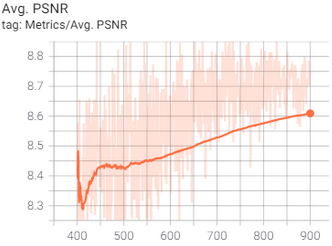 

We then created our test set of images to see the results:

    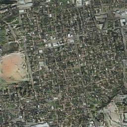
    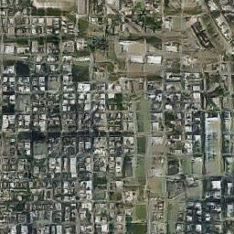
    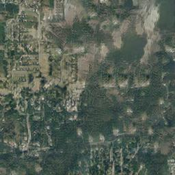
    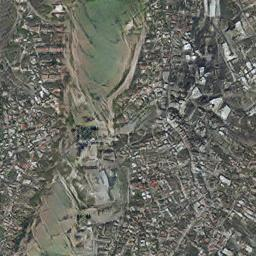
    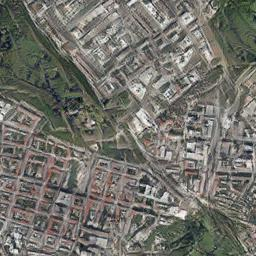

The generated images seem quite realistic for us. When comparing with our instance norm baseline (see below), almost no checkerboard effect can be appreciated. Non-labelled areas are more uniform, in the sense that there's almost no mix of grey (road) and green (trees) shapes. Hence that in the countryside example of kitsap29 (in the middle), it decides to "paint" more trees while in tyrol-29 (mid-right) and vienna29 (rightmost) a sort of grass lands are painted. So the model apparently learned to distinguish between a mask based on a small village and a mask based on more populated areas. On the other hand, the buildings and streests in austin29 (leftmost) are less distinguishable than its instance norm baseline counterpart.

    
    
    
    
    

### 6.iv.b. Combining the VGG loss and the L1 loss

As the toy trainings showed slightly better results when combining both a VGG loss with an L1 loss (LambdaL1 = 100 and LambdaVGG = 100), we then went for a full training with the same dataset and parameters. The training took 5h 26m and the progress values showed similar patterns as previous baselines except for the discriminator's loss, which showed tendency to lower (except for a crazy rise soon recovered) ending down to almost 0. The avg PSNR ended in a much higher value than using only the VGG loss as content loss:

  

The expectations where high, but the results where deceiving:

    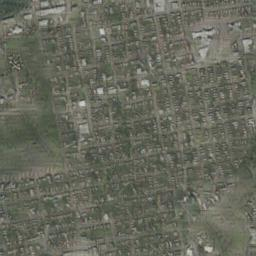
    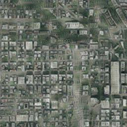
    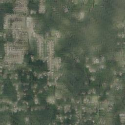
    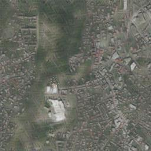
    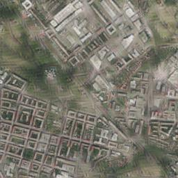

The resulting images are really blurry. The buildings are much less sharpen, the streets are much less realistic and non-labelled areas appear much less defined and full of checkerboard effects.

As a conclusion, defining the content loss with a VGG loss can pay off in some datasets. In our case, where the training time almost doubled, we don't think it is worth the extra cost compared to our baseline models.

<a href="#toc">To top</a>

## 6.v. Using the ReduceLROnPlateau scheduler 

One of the changes we tried in order to overcome the loose of color precision was using a [ReduceLROnPlateau](https://pytorch.org/docs/stable/optim.html#torch.optim.lr_scheduler.ReduceLROnPlateau) scheduler instead of a LambdaLR one. Pix2pix uses two schedulers: one for the generator and one for the discriminator. ReduceLROnPlateau needs the losses to decide when to change the learning rate, so we fed the generator loss to its scheduler and the discriminator loss to its own scheduler. The result was a disaster: the LR fell down to 0 in few epochs:

 

<a href="#toc">To top</a>

# 7. Quality metrics 

Our implementation of pix2pix calculates the average PSNR as a metric of the quality of the images crafted by the generator. In every training a bunch of images are reserved for validation purposes. It is the so called test dataset. The PSNR is based on the MSE between the images generated from the mask and the ground truth satellite image. As stated in the proposal of a [super resolution GAN](https://arxiv.org/pdf/1609.04802.pdf) "_... the  ability of MSE (and PSNR) to capture perceptually relevant differences, such as high texture detail, is very limited as they are defined based on pixel-wise image differences_". This is coincident with our experience in our trainings. As we already said in our [first trainings](#parameters), a higher PSNR value, which systematically peaked between epoch 100 and 200, didn't correspond to better generated images.

## 7.i. Fréchet Inception Distance (FID) 

[Martin Heusel et al. introduced](https://arxiv.org/abs/1706.08500) in 2017 the Fréchet Inception Distance, a metric to capture the sharpiness and quality of forged images from GANs in a manner closer to a human eye than other existing methods. It is based on the [Inception score](https://arxiv.org/abs/1606.03498), which uses a pretrained Inception v3 model trained on ImageNet to predict the scores of made up images. FID compares the predictions of generated images with the predictions for the original ones and elaborates a distance metric. If images are identical, a 0 distance is issued. As the distance grows, the quality of generated images worsens.

So to overcome the lack of correspondance between the PSNR and the quality we perceived from the generated images, we calculated the FID for the main trainings made throughout the project. A [complete table](images/20-FIDresults.pdf) can be consulted in the repository. Below you can find a partial result:

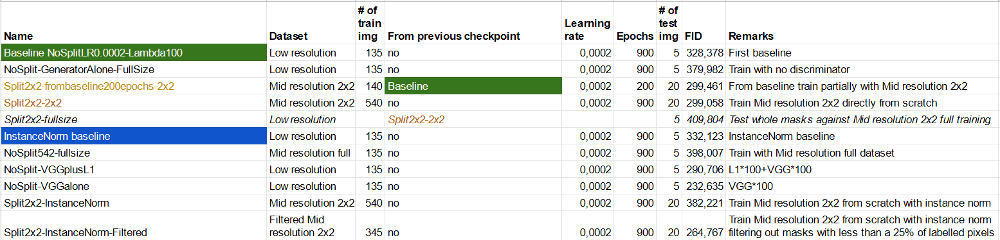

We found that the FID obtained was consistent with our observings in many examples. The [baseline](#baselineresults) (328.378) performed better than the [generator alone test](#generatoraloneimages) (379,982), the [model trained with 512x512 images](#biggerimages) (398.007) and slightly better than the [instance normalisation baseline](#fullsizemaskswithinstancenorm) (332.123). But we don't agree with the lower FIDs obtained in the trainings with 2x2 splits (both [from scratch](#2x2maskwith2x2training) and [from the baseline](#frombaseline)). We're also surprised of such a low value of the [VGG alone model](#VGGalone) (232.636), as the quality of images are, for us, comparable to those from the [baseline](#baselineresults) or the [instance normalisation baseline](#fullsizemaskswithinstancenorm). The lack of a big test dataset reduces the reliability of the FID, and that's our case.

We used an [implementation](https://github.com/mseitzer/pytorch-fid) simple to install through pip and easy to use.

As a conclusion, the Fréchet Inception Distance can't be relied on as an image quality metric with our dataset.

<a href="#toc">To top</a>

# 8. The Google Cloud instance 

Google Colab is a great development and testing environment for deep learning applications. It gives you access to a machine with a GPU, the Jupyter based environment makes it very easy to mix code, text or images, ... and it's free!!  But it has its limits. When long trainings come, Colab limits the use of GPUs. More than 3 hours per day of intensive use of a GPU will get you to a "you're a naughty boy/girl" message (remember it is free). And what is more important, most production environments for training or inferencing are not Colab or Jupyter based.

Both reasons were enough to follow the advice of our lecturers to create a [Google Cloud](https://cloud.google.com/) instance. As recommended, we opted for a Deep Learning VM instance with 2 CPUs, 13GB of RAM and an instance of a NVIDIA Tesla K80 GPU with 12GB of memory. To preinstall PyTorch 1.7 at least 50GB of disk are needed. We made a [log](infrastructures/GoogleCloudSetup.pdf) of most of the steps we made to make it work, including billing setup, permissions to all members of the team, gcloud command line tool installation, ... Don't expect it to be neither a manual nor a organised step by step guide.

<a href="#toc">To top</a>

## 8.i. Pros and cons 

So we had a shiny new cloud environment with no time limitations and we began using it. Soon we realized it wasn't a marvellous solution:

- **It is slower than Colab**: our first serious training (540 images coming from splitting by 2x2 the 135 full images we used in our baseline training) showed that every epoch lasted 104 seconds instead of the 52 seconds we expected (even using a bigger batch size). As all the images were stored in memory, disk access shouldn't be the problem. The CPU didn't seem busy, so we considered it coped feeding the GPU in time. The result was that training 900 epochs lasted almost 25 hours compared to the 3 hours it lasted the baseline training.
- **It costs money**: no surprise here. The good news is that the first time you use Google Cloud you're awarded 300€ to test their services. As a reference, our 25 hour training costed 16€.

So, why use the instance? Here are some reasons:
- **Production experience**: the instance gives us the oportunity to adapt the code to a production alike environment. Well, we're sure it is still a simple environment (single instance, no shared storage, no REST APIs exposed), but it is a step forward compared to sticking to Google Colab.
- **No time limit**: it allowes us running long trainings as a batch job, with no care about the limits of Colab or maintaining the session alive. The lack of time limits gives us more freedom, but money limits are still there.

<a href="#toc">To top</a>

# 9. Conclusions and Lessons Learned 

The following section aims to compressed down to a simple glimpse our whole quest. 

Early on in the decision process, we chose an implementation slightly less complex than the original pix2pix. That decision disembarked in the so-called “_baseline model_”. Several experiments using this implementation with our dataset revealed multiples sources of issues. Mainly named checkerboard effects, overexposure of green colors in many objects and an overall lack of detailing or plain blurriness in our generated images.

We attacked multiple frontiers as a hope to mitigate, or at least palliate, the prevalence of those problems. Several bullet points enumerate these strategies along with a brief explanation:

* __Data augmentation__: our original image size of 5000x5000 was way too big to be fed directly into the architecture. The input size for our model was set to 256x256, thus imposing a big loss of information (reduction factor of 306!). Cropping the original images was an obvious strategy. Two different datasets were created: 2x2 and 5x5 splits. There is some inconsistency in the results between the 2x2 and 5x5 dataset. While the 2x2 dataset did not show particular improvements and a new issue arise (color saturation), the 5x5 model did performed particularly good. In general, we consider that this strategy helped the model identify more objects and capture finer details. It also toned down the appearance of checkerboard effects (at least for urban landscapes in the 5x5 dataset).

* __Instance Normalization__: we attributed the source of color saturation in our generated images to the batch norm layer. Normalizing each image independently lowered color problems, ending up with a better color control in the output. However, instance normalization comes to the spend of a higher computational cost compared to its cousin.

* __Input size__: 256x256 was the original input size for the first convolutional layers. We decided to change it to 512x512 and run some experiments. It turned out that images were not better increasing input size. Further, given the overhead in computing time, we rapidly discarded this option.

* __Data filtering__: our dataset had a clear distinction between rural and urban landscapes. For rural landscapes, a considerable percentage of masks were purely black pixels. That lack of information prevented the model from correctly mapping input shapes onto output objects and, therefore, ending up with an overexposure of green colors (characteristics of forest/river-lands/lawns). We defined a metric for pixel density controlled, which was experimentally established at 25% (ratio of white pixels to total pixels). After applying this pre-processing condition to our dataset, color allocation greatly improved. The model learnt to map shapes from input masks to its real objects. It also reduced checkerboard effects and increased overall quality.

* __Regularization__: we threw one last punch to our baseline model in our quest for capturing those higher frequency details and, luckily, achieving amazing results! For that, we turn into regularizing our generator loss function by means of the so-called VGG loss. It has been demonstrated that VGG loss can be used for overcoming the blurriness provoked by pixel-wise loss functions such as MSE or MAE. Unfortunately, results were not that conclusive. Images were evaluated both visually and quantitatively and both ways revealed a slight improvement. On the other hand, the VGG imposes a tax on the computational cost, almost doubling training time!

The table below summarizes set-up and results for multiple experiments. As the control metric we chose FID (‘Fréchet Inception Distance’).

Name | Input size | Train | Test | Epochs | NormLayer | BatchSize | Filtered | Loss | FID | Quality
---- | ---------- | ----- | ---- | ------ | --------- | --------- | -------- | ---- | --- | -------
Baseline | 286x286 | 135 | 5 | 900 | Batch | 4 | No | L1 | 328,378 | Checkerboard, blurriness, green overexposure
Baseline 2x2split | 286x286 | 540 | 20 | 900 | Batch | 4 | No | L1 | 299,058 | Baseline model issues + color saturation
Baseline 2x2split | 286x286 | 540 | 20 | 900 | Instance | 2 | No | L1 | 382,221 | Better color allocation. Checkerboard and blurriness
Baseline 5x5split | 286x286 | 3376 | 125 | 440 | Instance | 2 | No | L1 | N/A | Some checkerboard in rural landscapes
Baseline 2x2split | 286x286 | 345 | 20 | 900 | Instance | 2 | Yes | L1 | 264,767 | Slight checkerboard. Most issues solved.
Baseline increased input size | 542x542 | 135 | 5 | 900 | Batch | 4 | No | L1 | 398,007 | Slightly worse than baseline
Baseline Regularized | 286x286 | 135 | 5 | 900 | Batch | 4 | No | VGG + L1 | 290,706 | Same issues as baseline and more blurriness
Baseline Regularized | 286x286 | 135 | 5 | 900 | Batch | 4 | No | VGG  | 232,635 | Slight crispness in images. No checkerboards or color saturation. 
Final Model | 286x286 | 2150 | 100 | 900 | Instance | 4 | Yes | VGG | 

<a href="#toc">To top</a>

# 10. Next steps 

The lack of time prevented us from trying some more ideas in our quest for obtaining more detailed images. Here we propose a list of potential research paths that could be followed through in order to improve output quality. Some of them are based on weaknesses spotted in the model and other are just alternative ways truncated by early decisions in our strategy.

- **Alternative implementations**: we sticked to a pix2pix model, but many other variants of GANs could be tried:
    - [CycleGAN](https://junyanz.github.io/CycleGAN/)
    - [Contrastive Unpaired Translation](https://github.com/taesungp/contrastive-unpaired-translation)
    - [Super resolution GANs](https://arxiv.org/pdf/1609.04802.pdf)
    - [Progressive growing GAN](https://arxiv.org/pdf/1710.10196.pdf)

- **LR_scheduler strategy**: all of our trainings used the default LambdaLR, except for some tests with [ReduceLROnPlateau](#plateau) based on the losses, which didn't work out. Trying other schedulers or different parametrizations for them (for example, ReduceLROnPlateau configured to maximize the PSNR) might help to get out of local minima.
- **Data augmentation for masks**. More variety of masks per ground-truth image and higher detail content per mask. Masks are very simplistic with an overall lack of detailing. Training a generative model to create higher quality mask using the original test images could open a new line of investigation.
- **Use lower layers in VGG loss**. Instead of considering all the convolutional layers from a VGG19 pretrained network to calculate de VGG loss, upper layers could be discarded to avoid features proner to a classification task. Moreover, a lighter network will improve training times.
- **Fine tuning pixel ratio/pixel density for image filter**. Our original value of 0.25 was choosen pretty randomly. Thus a need for finer selection could weed out problematic masks (high non-labelled are per picture). As the saying goes: ‘_You cannot get something out of nothing_’.
- **Improve upscale layers** to reduce/eliminate checkerboard effects that have contaminated practically all results. Even though Instance Normalization handled most of this issues pretty well, a deeper understanding might be needed. Upscale convolutional layers are causing this effect and alternatives could be helpful to completely erase its nature.
- **Embed extra information to binary mask**, aiding the model to learn/map shapes to actual colors and objects. This could be a segmentation mask adding object labels or adding color-based information to the binary mask.
- **Transfer learning**. Given the absence of a huge dataset, random initialization might not be enough to get the model out of local minima. Training curves notoriously showed plateaus from which the model could not escape. Searching for pre-trained implementations with valuable parameters could further increase chances of obtaining higher quality results. At the beginning of the project, it was evaluated the option of implementing pre-trained ResNet blocks but discarded for time-constrain reasons.
